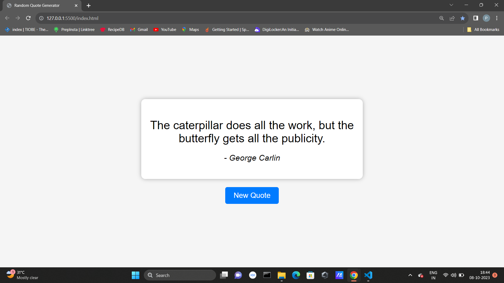

# Random Quote Generator

This is a simple web application that generates random quotes using JavaScript. It fetches quote data from a JSON file and displays a new random quote each time you click the "New Quote" button.

## Table of Contents

- [Demo](#demo)
- [Features](#features)
- [Getting Started](#getting-started)
- [Usage](#usage)
- [Built With](#built-with)
- [License](#license)

## Demo

You can try the live demo of the Random Quote Generator here: [Live Demo](#)



## Features

- Generates random quotes.
- Fetches quote data from a JSON file.
- Simple and intuitive user interface.

## Getting Started

To run this project locally, follow these steps:

### Prerequisites

You need a web browser to open the HTML file.

### Installation

1. Clone the repository to your local machine:

   ```bash
   git clone https://github.com/Prabakaran-MS/Random-Quote-Generator.git
